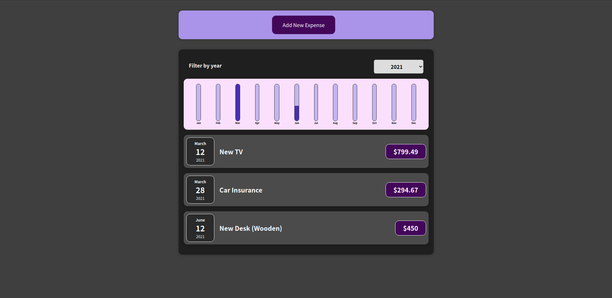

# Expense Tracker

First project from the [React - The Complete Guide](https://www.udemy.com/course/react-the-complete-guide-incl-redux/).

Learned working with components, props, useState and function pointers to pass data from child to parent.

## Preview

## Getting started

    git clone https://github.com/GokhanTurgut/expense-tracker.git
    cd expense-tracker
    npm install
    npm start